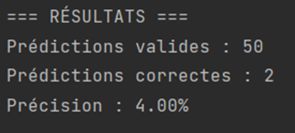
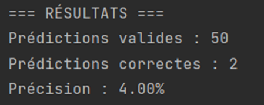
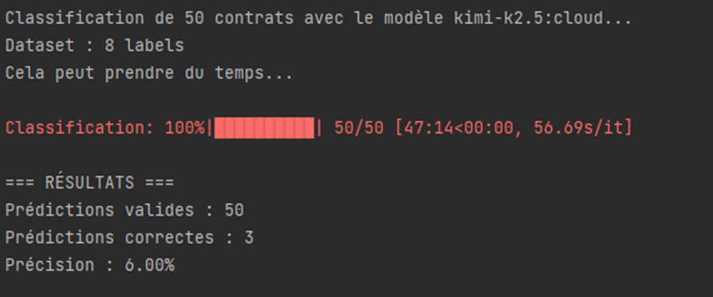
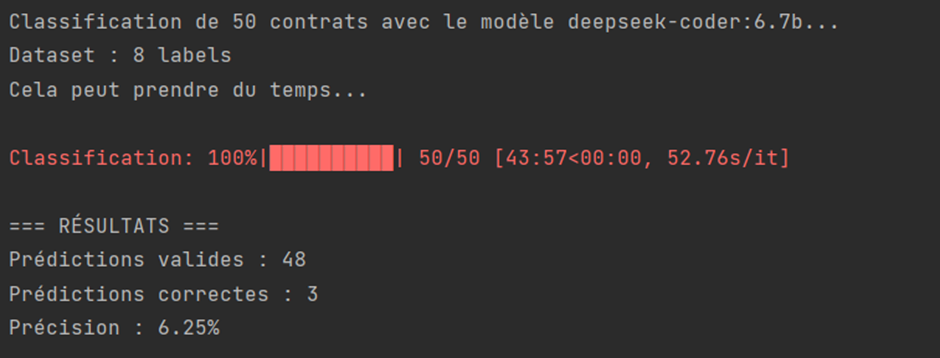

# PPE_LLM_test_Smart_contract

  

Project aimed at testing which Ollama LLM is the most accurate for analyzing Solidity Smart Contracts

---

### Results:
#### 4 labels sur 50:

Model : qwen2.5-coder:7b

Model :qwen2.5-coder:7b

--- 
#### 8 labels sur 50:
Model : qwen2.5-coder:7b

